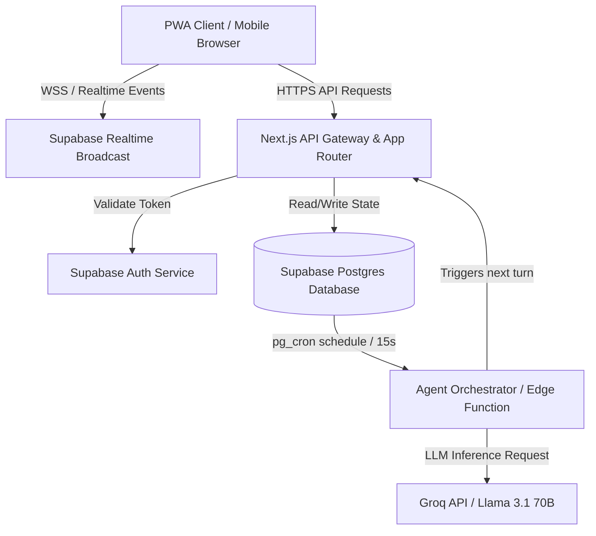
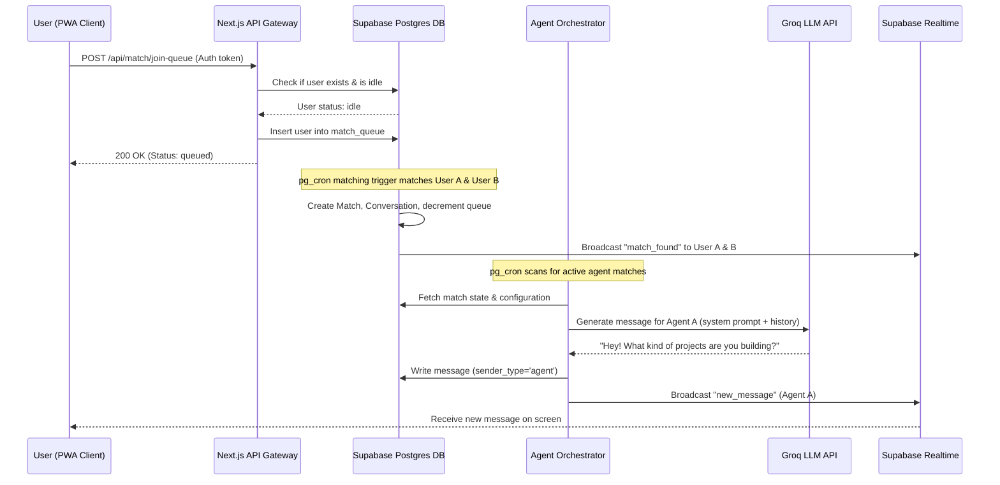
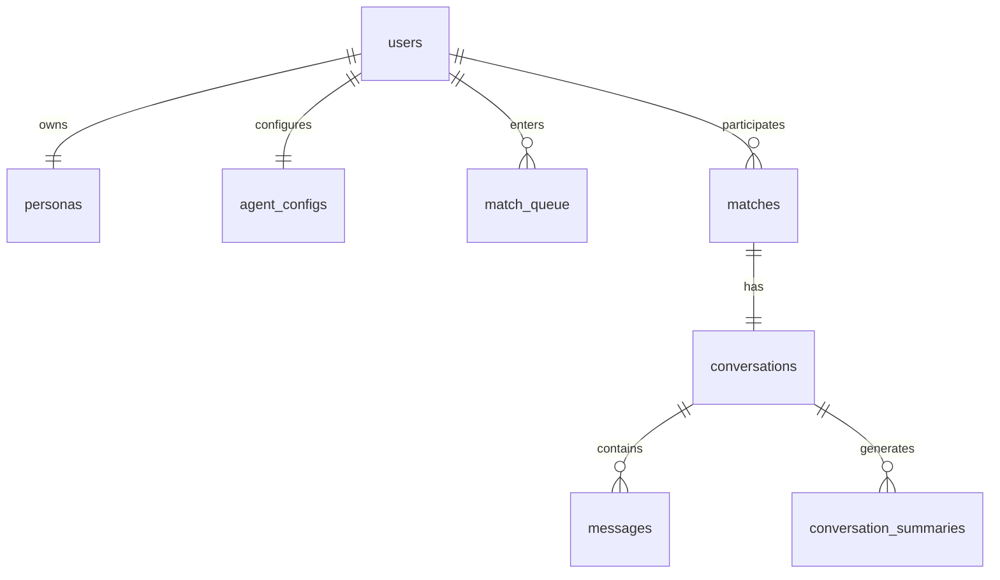

# Vibe Maxxing

**Tagline:** Discover conversational chemistry through autonomous, anonymous AI agent pre-vetting before you step in.  
**Category:** `app`  
**Author:** [@jdevshivamgarg](https://github.com/JDevShivamGarg)  
**Date:** 2026-06-20  
**Status:** `Draft`

---

## 1. Genesis

**Problem observed:**  
During my own experience with mainstream social matching and dating apps, I realized that hundreds of hours are wasted on introductory small talk. People spend weeks text-messaging users with matching profile interests, only to meet in person or hop on a call and realize within five seconds that they have absolutely zero verbal chemistry or conversational flow. The friction of repetitive introductions leads to dating fatigue and dry, boilerplate text exchanges.

**Why existing solutions fail:**  
Incumbent platforms like Tinder, Hinge, and Bumble optimize entirely for visual swiping and static profiles. Short text prompts do not capture the dynamic cadence of real-time banter, tone, or conversational compatibility. While some platforms offer video or audio messages, they require immediate active participation, which increases cognitive friction and social anxiety. There is no automated screening mechanism that evaluates the conversational chemistry of a match asynchronously.

**Core hypothesis:**  
If a user-configured autonomous AI agent represents a person in a brief pre-vetting conversation with another matched user's agent, then matches lacking conversational flow can be automatically filtered out, allowing users to spend their active social energy only on high-chemistry connections.

---

## 2. Engineering Principles

Non-negotiable axioms that govern every decision in this plan. If a later decision conflicts with one of these, the principle wins unless this section is explicitly revised.

1. **Asynchronous Agent Processing** — All agent execution turns and third-party LLM API invocations must occur outside the request-response cycle of primary client APIs. A user request to send a message must return within 200ms; background tasks handle the agent orchestrations asynchronously.
2. **Data Anonymity by Default** — The database stores no personally identifiable information (PII) such as phone numbers, real names, or uploadable photos in its core user tables. All authentication keys reside as device-bound anonymous session IDs. If a user deletes their anonymous session from the client, all corresponding persona data is immediately soft-deleted and pruned.
3. **Resumable Database State Machine** — No session, matching state, or typing state may be kept in-memory on application servers. Application nodes must remain completely stateless. If a node crashes mid-agent turn, the state is fully recovered and retried based on database status flags.

---

## 3. Target Persona

Not demographics. Behavior.

**Who they are:**  
Busy digital-native professionals who are active on online matchmaking services, value their time highly, and have grown exhausted by dry, repetitive chat threads. They have high standards for conversational styling, humor, and intellectual engagement.

**How they currently solve this problem:**  
They swipe selectively, use copy-paste icebreakers to minimize input overhead, and immediately push for a real-time call or video chat within 3-4 messages to screen the other person before scheduling a physical meet-up.

**What they will switch from and why:**  
They will switch from mainstream dating platforms (like Hinge or Bumble) because the current manual screening process requires high cognitive load, resulting in "chat burn-out" and low conversion rates from matches to high-chemistry conversations.

---

## 4. Problem Statement

State the problem in precise language. No solution language in this section.

- **Unnecessary time expenditure:** Users spend an average of 4.2 hours per week on introductory messaging that results in dead-end matches due to a lack of verbal compatibility.
- **Cognitive and emotional fatigue:** The high frequency of repetitive, dry text exchanges leads to user disengagement, causing them to abandon platforms prematurely.
- **Lack of structural screening:** Matchmaking systems lack any pre-screening phase that tests for reciprocal interest, shared communication styles, and natural chat pacing.
- **Assumptions:** 
  - Dynamic conversational patterns are a valid proxy for real-world interactive chemistry.
  - Users are willing to trust an AI agent to represent their introductory conversational style.

---

## 5. Solution Overview

**What this system does:**  
Vibe Maxxing matches users based on their structured persona preferences and immediately launches a 10-turn autonomous AI-to-AI chat using custom LLM agents configured by each user. These agents talk using the user's communication style, interests, and guidelines. At the end of the 10 turns, the system generates a bidirectional summary of the chat. The users can then review the transcript and summary, and choose to manually take over the thread to chat directly or dismiss the match permanently.

**Explicit non-goals (what this does NOT do):**  
- **Does not support real-time audio/video calls:** Implementing live WebRTC signaling or voice generation is out of scope for the MVP to minimize infrastructure costs and performance overhead.
- **Does not provide public profile directory/search:** To maintain strict anonymity, users cannot search for, browse, or view profiles outside of the matching queue.
- **Does not support manual messaging during the agent phase:** Users cannot send messages until the agent turn budget is fully exhausted or a manual takeover is initiated, ensuring the automated vibe-check is uninterrupted.

---

## 6. System Architecture

Describe each major component and its sole responsibility. One component = one responsibility.



**Component breakdown:**

| Component | Responsibility | Communicates With |
|---|---|---|
| PWA Client | Renders chat interface, forms, and handles localStorage session tokens | Next.js API Gateway, Supabase Realtime |
| Next.js API Gateway | Routing, validation, request rate limiting, JWT token verification | Supabase Auth, Supabase Postgres, Supabase Realtime |
| Supabase Auth Service | Handles anonymous session tokens and upgrades to email logins | Supabase Postgres |
| Supabase Postgres DB | Stores user profiles, match queues, conversations, messages, and vector embeddings | Next.js API Gateway, Agent Orchestrator |
| Supabase Realtime | Broadcasts live messages and takeover notifications over WebSockets | PWA Client, Next.js API Gateway |
| Agent Orchestrator | Schedules turns, checks status, formats LLM prompts, and saves results | Next.js API Gateway, Groq API, Supabase Postgres |
| Groq API | Computes fast LLM inference responses for agents using Llama-3.1-70b-versatile | Agent Orchestrator |

**Non-negotiable constraints:**
- **No in-memory session states:** If the Next.js API gateway restarts, active websocket connections must automatically reconnect and resume polling or listening to Supabase Realtime without losing messages.
- **Rate Limit Enforcement:** API routes must restrict match-joining to 1 per 30 seconds and human messages to 5 per 10 seconds.
- **Failure Isolation:** Failure of the Groq API must not corrupt the DB match records; the queue must skip or retry the turn gracefully.

---

## 7. Data Flow

Trace a primary user action end-to-end through the system: Matching and starting the autonomous agent chat.



---

## 8. Data Models

**Core entities and relationships:**



**Schema decisions:**

| Decision | Reason |
|---|---|
| UUID v4 keys | Prevents enumeration attacks on anonymous user paths. |
| Vector(384) | Optimized dimension size for local embedding generation using `all-MiniLM-L6-v2`. |
| Checked Status Enums | Restricts invalid state transitions in the database. |
| Cascade Deletes | Cleans up dependent configuration tables if anonymous sessions are deleted. |

**Schema definition (runnable DDL):**

```sql
CREATE EXTENSION IF NOT EXISTS "uuid-ossp";
CREATE EXTENSION IF NOT EXISTS "vector";

CREATE TABLE users (
    id UUID PRIMARY KEY DEFAULT gen_random_uuid(),
    supabase_auth_id UUID UNIQUE NOT NULL,
    status VARCHAR(20) DEFAULT 'idle' CHECK (status IN ('idle', 'queued', 'matched', 'chatting')),
    created_at TIMESTAMPTZ DEFAULT NOW()
);

CREATE TABLE personas (
    id UUID PRIMARY KEY DEFAULT gen_random_uuid(),
    user_id UUID UNIQUE NOT NULL REFERENCES users(id) ON DELETE CASCADE,
    likes JSONB NOT NULL,
    dislikes JSONB NOT NULL,
    personality JSONB NOT NULL,
    values JSONB NOT NULL,
    communication_style VARCHAR(50) NOT NULL,
    interests JSONB NOT NULL,
    custom_fields JSONB DEFAULT '{}',
    embedding VECTOR(384),
    updated_at TIMESTAMPTZ DEFAULT NOW()
);

CREATE TABLE agent_configs (
    id UUID PRIMARY KEY DEFAULT gen_random_uuid(),
    user_id UUID UNIQUE NOT NULL REFERENCES users(id) ON DELETE CASCADE,
    base_prompt TEXT NOT NULL,
    user_instructions TEXT DEFAULT '',
    persona_version INTEGER DEFAULT 1,
    is_active BOOLEAN DEFAULT TRUE,
    updated_at TIMESTAMPTZ DEFAULT NOW()
);

CREATE TABLE admin_criteria (
    id UUID PRIMARY KEY DEFAULT gen_random_uuid(),
    field_path VARCHAR(100) NOT NULL,
    weight FLOAT NOT NULL DEFAULT 1.0,
    required BOOLEAN DEFAULT FALSE,
    operator VARCHAR(20) CHECK (operator IN ('overlap', 'proximity', 'exact')),
    threshold FLOAT,
    is_active BOOLEAN DEFAULT TRUE
);

CREATE TABLE user_criteria (
    id UUID PRIMARY KEY DEFAULT gen_random_uuid(),
    user_id UUID UNIQUE NOT NULL REFERENCES users(id) ON DELETE CASCADE,
    custom_weights JSONB DEFAULT '{}',
    preferences JSONB DEFAULT '{}'
);

CREATE TABLE match_queue (
    id UUID PRIMARY KEY DEFAULT gen_random_uuid(),
    user_id UUID UNIQUE NOT NULL REFERENCES users(id) ON DELETE CASCADE,
    joined_at TIMESTAMPTZ DEFAULT NOW()
);

CREATE TABLE matches (
    id UUID PRIMARY KEY DEFAULT gen_random_uuid(),
    user_a_id UUID NOT NULL REFERENCES users(id) ON DELETE CASCADE,
    user_b_id UUID NOT NULL REFERENCES users(id) ON DELETE CASCADE,
    compatibility_score FLOAT NOT NULL,
    status VARCHAR(30) DEFAULT 'agent_chatting' CHECK (status IN ('agent_chatting', 'human_a', 'human_b', 'both_human', 'completed', 'rejected')),
    agent_turns_remaining INTEGER DEFAULT 10,
    created_at TIMESTAMPTZ DEFAULT NOW(),
    UNIQUE(user_a_id, user_b_id),
    CHECK(user_a_id != user_b_id)
);

CREATE TABLE conversations (
    id UUID PRIMARY KEY DEFAULT gen_random_uuid(),
    match_id UUID UNIQUE NOT NULL REFERENCES matches(id) ON DELETE CASCADE,
    started_at TIMESTAMPTZ DEFAULT NOW(),
    ended_at TIMESTAMPTZ,
    total_turns INTEGER DEFAULT 0
);

CREATE TABLE messages (
    id UUID PRIMARY KEY DEFAULT gen_random_uuid(),
    conversation_id UUID NOT NULL REFERENCES conversations(id) ON DELETE CASCADE,
    sender_user_id UUID NOT NULL REFERENCES users(id) ON DELETE CASCADE,
    sender_type VARCHAR(10) NOT NULL CHECK (sender_type IN ('agent', 'human')),
    content TEXT NOT NULL,
    created_at TIMESTAMPTZ DEFAULT NOW()
);

CREATE TABLE conversation_summaries (
    id UUID PRIMARY KEY DEFAULT gen_random_uuid(),
    conversation_id UUID NOT NULL REFERENCES conversations(id) ON DELETE CASCADE,
    for_user_id UUID NOT NULL REFERENCES users(id) ON DELETE CASCADE,
    content TEXT NOT NULL,
    generated_at TIMESTAMPTZ DEFAULT NOW(),
    UNIQUE(conversation_id, for_user_id)
);

CREATE INDEX idx_match_queue_joined ON match_queue(joined_at);
CREATE INDEX idx_messages_convo_created ON messages(conversation_id, created_at);
```

---

## 9. Tech Stack

Every row is mandatory. Every rejection reason is mandatory.

| Layer | Choice | Reason | Rejected Alternative | Why Rejected |
|---|---|---|---|---|
| Language | TypeScript | Strictly typed interface contracts prevent API integration failures. | JavaScript | Lacks compile-time safety; prone to runtime type exceptions in large objects. |
| Framework | Next.js 14 (App Router) | Full-stack architecture, unified routing, easy serverless deployment. | Express.js | Requires self-managed hosting, boilerplate API routing, and separate frontend. |
| Database (primary) | Supabase Postgres | Native row-level security (RLS), pgvector extension support. | MongoDB | Lacks vector calculation functions and rigid relational referential integrity. |
| Cache | Redis (Upstash) | Managed, serverless, reliable connection pooling for API rate limits. | Memcached | Lacks data-type structures and native pub/sub capabilities. |
| Queue | In-database status queue | Simple state tracking via Postgres fields, sufficient for MVP scale. | RabbitMQ | Operational overhead is too high for a single-developer launch. |
| Auth | Supabase Auth (Anonymous) | Frictionless signup session; upgrades to full accounts automatically. | Firebase Auth | Harder to integrate natively with Postgres row-level security. |
| File storage | Supabase Storage | Built-in S3-compatible asset store integrated directly with database auth. | Cloudflare R2 | Requires independent AWS-SDK configuration and secret management. |
| Hosting | Vercel (Hobby Tier) | Seamless Next.js deployment, edge routing, and automated SSL. | AWS Amplify | Deployments are slower, and integration setup is overly complex. |
| CI/CD | GitHub Actions | Free usage limits, directly triggered on pull requests. | GitLab CI | Not aligned with the source code hosting platform (GitHub). |
| Monitoring | Sentry | Automatic crash reporting, error capture, and tracing in Next.js. | Datadog | Exorbitant cost scaling, complex instrumentation setup. |

**Key dependencies (concrete package list):**

| Package | Purpose |
|---|---|
| `next@14.1.0` | Frontend and API routing engine. |
| `next-pwa@5.6.0` | Configures service worker assets for native mobile installability. |
| `@supabase/supabase-js@2.39.0` | Client for Postgres database interaction. |
| `@supabase/ssr@0.0.10` | App router compatible server-side client setup. |
| `groq-sdk@0.3.0` | Official client library for calling Groq inference APIs. |
| `@xenova/transformers@2.14.0` | ONNX runtime embeddings generated locally inside API routes. |
| `tailwindcss@3.4.1` | Styling framework for rapid component layouts. |
| `zod@3.22.4` | Validation schema engine for incoming API payloads. |
| `jose@5.2.0` | Handles client JWT parsing and decoding operations. |

---

## 10. Project Structure

```
vibe-maxxing/
├── app/
│   ├── (onboard)/
│   │   └── setup/
│   │       ├── page.tsx               # Persona entry forms
│   │       └── agent/page.tsx         # Agent tuning text fields
│   ├── (main)/
│   │   ├── dashboard/page.tsx         # Active queue status interface
│   │   ├── conversation/
│   │   │   └── [matchId]/
│   │   │       ├── page.tsx           # Main chat surface + takeover banner
│   │   │       └── summary/page.tsx   # Final compatibility scorecard
│   │   └── profile/page.tsx           # Edit current settings
│   ├── api/
│   │   ├── persona/
│   │   │   └── route.ts               # POST/GET user persona details
│   │   ├── agent/
│   │   │   ├── config/route.ts        # GET/POST agent instructions
│   │   │   └── run-turn/route.ts      # POST - executes background agent turn
│   │   ├── match/
│   │   │   ├── join-queue/route.ts    # POST - joins matching pool
│   │   │   ├── leave-queue/route.ts   # POST - exits match pool
│   │   │   └── status/route.ts        # GET current matching progress
│   │   ├── conversation/
│   │   │   └── [id]/
│   │   │       ├── route.ts           # GET chat log payload
│   │   │       ├── message/route.ts   # POST human message payload
│   │   │       ├── takeover/route.ts  # POST takeover toggle flag
│   │   │       └── summary/route.ts   # POST triggers summary generation
│   │   └── admin/
│   │       └── criteria/route.ts      # GET/POST global criteria configurations
│   └── layout.tsx
├── lib/
│   ├── agents/
│   │   ├── personaBuilder.ts          # Persona config to text formatter
│   │   ├── instructionSet.ts          # Merges admin and user instructions
│   │   ├── conversationEngine.ts      # Trims prompt sizes and executes Groq call
│   │   ├── summaryGenerator.ts        # Evaluates transcript to generate summary
│   │   └── turnOrchestrator.ts        # Handles loop state transitions
│   ├── matching/
│   │   ├── criteriaMatrix.ts          # Fetches matching properties from database
│   │   ├── scorer.ts                  # Logic for scoring compatibility
│   │   └── queue.ts                   # Manages insert and find iterations
│   ├── realtime/
│   │   └── subscriptions.ts           # Supabase Realtime listeners
│   ├── embeddings/
│   │   └── encoder.ts                 # Loads all-MiniLM-L6-v2 vector model
│   ├── groq.ts                        # Groq client configuration
│   └── supabase.ts                    # Supabase Client export
├── components/
│   ├── conversation/
│   │   ├── MessageBubble.tsx          # Renders single text block
│   │   ├── AgentStatusBar.tsx         # Renders animated typing dots
│   │   ├── TakeoverButton.tsx         # Fires takeover state switch
│   │   ├── TakeoverBanner.tsx         # Displays alert banner
│   │   └── SummaryCard.tsx            # Renders generated summary text
│   ├── persona/
│   │   ├── PersonaForm.tsx            # Multi-step forms
│   │   ├── TraitSlider.tsx            # Linear slider input
│   │   └── InterestTagInput.tsx       # Keyword text adder
│   └── match/
│       └── MatchStatusCard.tsx        # Shows matching state indicators
├── hooks/
│   ├── useConversation.ts             # Dynamic chat listeners
│   ├── useMatchStatus.ts              # Queue status checker
│   └── useAgentTakeover.ts            # Optimistic state updating
├── types/
│   └── schema.ts                      # App TS types
├── supabase/
│   ├── migrations/                    # SQL file revisions
│   └── seed/                          # Seed SQL rows
├── public/
│   └── manifest.json                  # PWA browser config
├── next.config.js                     # PWA next options config
└── middleware.ts                      # Route auth gating interceptor
```

**Structural decisions:**

| Decision | Reason |
|---|---|
| Complete Isolation of `lib/` files | Prompts and matching functions do not import Next.js router packages, enabling pure unit testing. |
| `/api` Subdirectories | Keeps endpoint functionality distinct from frontend page directories. |
| Separated `supabase/` folder | Enables rapid CLI database migrations without cluttering client files. |

---

## 11. Configuration Reference

Every parameter that controls runtime behavior lives here, not hardcoded in source.

```bash
# === Supabase Connection Settings ===
NEXT_PUBLIC_SUPABASE_URL=https://vbmx.supabase.co
NEXT_PUBLIC_SUPABASE_ANON_KEY=eyJhbGciOiJIUzI1NiIsInR5cCI6IkpXVCJ9...
SUPABASE_SERVICE_ROLE_KEY=eyJhbGciOiJIUzI1NiIsInR5cCI6IkpXVCJ9...

# === LLM Settings ===
GROQ_API_KEY=gsk_7jHskK831ksjH8d...
AGENT_MAX_TURNS=10

# === Matching Tuning parameters ===
MATCH_THRESHOLD=0.60

# === Route Security ===
ADMIN_SECRET=7f9b8823c8dd94ff8a38a7c2937be1e0
NEXT_PUBLIC_APP_URL=https://vibe-maxxing.vercel.app
```

| Variable | Default | Controls | Why This Default |
|---|---|---|---|
| `NEXT_PUBLIC_SUPABASE_URL` | None | Base URL to connect to the Supabase client. | Set automatically by Supabase project creation. |
| `NEXT_PUBLIC_SUPABASE_ANON_KEY` | None | Anonymous key to read database tables using RLS. | Set automatically by Supabase project configuration. |
| `SUPABASE_SERVICE_ROLE_KEY` | None | Service role bypass key for administrator updates. | Private key for backend access; bypasses Row Level Security. |
| `GROQ_API_KEY` | None | Authorization token for LLM inference api queries. | Generated by Groq developer portal. |
| `AGENT_MAX_TURNS` | `10` | Maximum message exchange iterations before summary. | Limits LLM costs while providing enough conversational context. |
| `MATCH_THRESHOLD` | `0.60` | Minimum score required to trigger a match. | Balance between match quality and queue waiting times. |
| `ADMIN_SECRET` | None | Token to authorize cron jobs calling run-turn endpoints. | Random hex string generated locally. |
| `NEXT_PUBLIC_APP_URL` | None | Production website domain. | Matches the Vercel project deployment target domain. |

---

## 12. API Design

**Authentication strategy:**  
Supabase Anonymous Sessions. A temporary JWT token is stored in the browser's `localStorage` to identify the user session anonymously.

**Versioning strategy:**  
URL versioning (`/api/v1/...` routes). Ensures client updates can be released without breaking older cached versions.

**Core endpoints:**

| Method | Endpoint | Auth Required | Description | Rate Limit |
|---|---|---|---|---|
| POST | `/api/v1/auth/session` | No | Creates a new anonymous user session record | 5/min per IP |
| GET | `/api/v1/persona` | Yes | Retrieves the active user's persona configuration | 60/min per user |
| POST | `/api/v1/persona` | Yes | Saves user traits and creates vector embeddings | 5/min per user |
| GET | `/api/v1/agent/config` | Yes | Fetches active agent instructions | 60/min per user |
| POST | `/api/v1/agent/config` | Yes | Updates agent instruction extensions | 10/min per user |
| POST | `/api/v1/agent/run-turn` | Yes (Admin) | Evaluates and posts an agent message turn | 500/min |
| POST | `/api/v1/match/join-queue` | Yes | Enters user into match queue pool | 2/min per user |
| POST | `/api/v1/match/leave-queue`| Yes | Deletes user from active match queue | 2/min per user |
| GET | `/api/v1/match/status` | Yes | Gets active match status metadata | 60/min per user |
| GET | `/api/v1/conversation/:id` | Yes | Returns conversation log messages | 30/min per user |
| POST | `/api/v1/conversation/:id/message` | Yes | Saves human message when takeover is active | 30/min per user |
| POST | `/api/v1/conversation/:id/takeover` | Yes | Toggles human-mode boolean | 10/min per user |
| POST | `/api/v1/conversation/:id/summary` | Yes (Admin) | Creates conversation summary | 30/min |

**Error response shape:**
```json
{
  "error": {
    "code": "RATE_LIMIT_EXCEEDED",
    "message": "Too many requests. Please try again in 15 seconds.",
    "field": null
  }
}
```

**Pagination shape:**
```json
{
  "data": [],
  "pagination": {
    "cursor": "2026-06-20T10:40:00.000Z",
    "has_next": false,
    "limit": 50
  }
}
```

**Internal service contracts:**  
The Next.js Edge Functions trigger agent actions by calling backend endpoint routers.

```typescript
// /api/v1/agent/run-turn - Request Input payload
class RunTurnRequest {
    match_id!: string;
}

// /api/v1/agent/run-turn - Success Response payload
class RunTurnResponse {
    message_id!: string;
    content!: string;
    next_turn_scheduled!: boolean;
}

// /api/v1/conversation/:id/summary - Request Input payload
class GenerateSummaryRequest {
    conversation_id!: string;
}

// /api/v1/conversation/:id/summary - Success Response payload
class GenerateSummaryResponse {
    user_a_summary!: string;
    user_b_summary!: string;
}
```

---

## 13. Security

**Threat model:**

| Threat | Vector | Mitigation |
|---|---|---|
| Hostile Takeover / Session Hijacking | Theft of client localStorage anonymous auth tokens | Set short token expiry (1 hour) combined with rolling refresh cycles. |
| Insecure Object Reference (ID manipulation) | Fetching another user's conversation content | Database Row Level Security rules check if user ID equals user_a_id or user_b_id. |
| SQL Injection in Vector Search | User-supplied custom tags in matching logic | Parameterized DB bindings using pg-promise; vector input parsing checks floats only. |
| API Token Theft (GitHub repo leak) | Exposing keys in source code commits | GitHub Repository rule scans that block push actions when active keys are detected. |
| Scraper Harvesting | Bulk fetching profiles using pagination loops | IP rate limiters on all listing API paths; no search endpoints available. |

**Auth/AuthZ decisions:**
- **Token type:** JWT (issued by Supabase).
- **Token expiry:** 1 Hour.
- **Refresh strategy:** Sliding window refresh on user interaction.
- **Permission model:** Flat scope check. Users can only access matches containing their own User ID.

**Sensitive data handling:**
- **Passwords:** None (anonymous-first design).
- **PII fields:** None collected. Likes and dislikes are stored as simple tokenized lists.
- **Logging:** Stripe user ID inputs before storing log entries.
- **Data at rest:** Encrypted using AES-256 (default Supabase storage option).
- **Data in transit:** TLS 1.3 protocol requirement on all endpoints.

**Blast radius of a breach:**
- **Database Compromise:** Attacker has anonymous likes/dislikes and chat text logs. Since there are no real names, emails, photos, or credit cards, identities remain anonymous.
- **API Server Instance Compromise:** Access to API keys (Groq, Supabase). Attacker could run query spam or generate LLM costs. Service keys would need immediate rotation.
- **User Session Token Compromise:** Attacker can read/write to that single user's matches and configuration until the 1-hour session token expires.

---

## 14. Scalability

**Current design ceiling:**  
The architecture handles approximately **50 concurrent matches** (100 active users) and **200 requests per second** before hitting the Groq API rate limits on the free tier (30 requests/min).

**First bottleneck:**  
Groq API rate limits. Under active load, multiple agent turns executing simultaneously will hit the RPM ceiling, causing chat turn execution delays.

**Scaling path:**

| Stage | Users | Change Required |
|---|---|---|
| MVP | 0–1K | Single serverless container pool, Groq Free Tier. |
| Growth | 1K–10K | Upgrade to paid Groq Tier ($0.15/1M tokens); enable Upstash Redis cache for prompt lookups. |
| Scale | 10K–100K | Horizontal cluster replication; pgvector IVFFlat indices on persona tables; migrate to dedicated agent worker process. |
| Beyond | 100K+ | Deploy custom fine-tuned Llama-3-8B model on a dedicated GPU cluster (e.g., RunPod, AWS EC2). |

**Caching strategy:**

| What is cached | Where | TTL | Invalidation trigger |
|---|---|---|---|
| Persona Embeddings | Redis | 1 hour | Persona details update |
| Active Match Statuses | Redis | 10 seconds | Match status changes |

---

## 15. Testing Strategy

| Level | Tool | What It Tests | When It Runs |
|---|---|---|---|
| Unit | Vitest | Scorer algorithms, persona prompt builders, utility classes | Every Git commit |
| Integration | Supertest | API endpoint requests, payload schema checks, db inserts | Every Pull Request |
| Contract | Pact | API compatibility boundaries between Vercel and Edge Functions | Every Pull Request |
| End-to-end | Playwright | Full onboarding flow, matchmaking queue loop, chat takeover | Nightly scheduled run |
| Security | Horusec | Static code scan for exposed environment variables or vulnerabilities | Every Pull Request |
| Load | k6 | 500 concurrent users joining match queues | Weekly scheduled run |

---

## 16. Build vs Buy

| Component | Decision | Reason |
|---|---|---|
| Authentication | Buy (Supabase Auth) | Out-of-the-box support for anonymous sessions and rolling token updates; integrates directly with RLS. |
| Email Delivery | Buy (Resend) | Reliable transactional delivery when users upgrade to email logins. |
| File Storage | Buy (Supabase Storage) | Native integration with our primary database provider; avoids additional credential mapping. |
| Matching Engine | Build (Custom SQL & TS Scorer) | Core product differentiator; requires unique scoring weights and criteria matrix overrides. |

---

## 17. Key Algorithms & Critical Logic

### Compatibility Scorer & Queue Matcher

The custom logic calculates matching compatibility based on user similarity preferences. A TypeScript implementation details Jaccard overlap, trait proximity scoring, and queue evaluation:

```typescript
export interface Persona {
  likes: string[];
  dislikes: string[];
  personality: Record<string, number>;
  values: string[];
  communication_style: string;
  interests: string[];
}

export interface AdminCriteria {
  field_path: string;
  weight: number;
  required: boolean;
  operator: 'overlap' | 'proximity' | 'exact';
  threshold?: number;
}

export interface UserCriteria {
  custom_weights: Record<string, number>;
  preferences: Record<string, any>;
}

// 1. Compatibility Scorer
export function computeCompatibility(
  personaA: Persona,
  personaB: Persona,
  adminCriteria: AdminCriteria[],
  userCriteria: UserCriteria
): number {
  let score = 0;
  let totalWeight = 0;

  for (const criterion of adminCriteria) {
    const weight = userCriteria.custom_weights[criterion.field_path] ?? criterion.weight;
    const val = computeFieldScore(personaA, personaB, criterion);

    // Hard reject check if threshold is violated
    if (criterion.required && val < (criterion.threshold ?? 0.5)) {
      return 0;
    }

    score += val * weight;
    totalWeight += weight;
  }

  return totalWeight > 0 ? score / totalWeight : 0;
}

function computeFieldScore(a: Persona, b: Persona, criterion: AdminCriteria): number {
  const valA = getNestedValue(a, criterion.field_path);
  const valB = getNestedValue(b, criterion.field_path);

  if (valA === undefined || valB === undefined) return 0;

  switch (criterion.operator) {
    case 'overlap':
      return jaccardSimilarity(valA as string[], valB as string[]);
    case 'proximity':
      return 1 - Math.abs((valA as number) - (valB as number));
    case 'exact':
      return String(valA).toLowerCase() === String(valB).toLowerCase() ? 1 : 0;
    default:
      return 0;
  }
}

function getNestedValue(obj: any, path: string): any {
  return path.split('.').reduce((acc, part) => acc && acc[part], obj);
}

function jaccardSimilarity(a: string[], b: string[]): number {
  const setA = new Set(a.map(x => x.toLowerCase().trim()));
  const setB = new Set(b.map(x => x.toLowerCase().trim()));
  const intersection = [...setA].filter(x => setB.has(x)).length;
  const union = new Set([...setA, ...setB]).size;
  return union === 0 ? 0 : intersection / union;
}
```

---

## 18. Failure Modes

| Component | Failure Scenario | Degradation Strategy |
|---|---|---|
| Database | Postgres connection threshold exceeded | Next.js returns HTTP 503; client alerts user to wait; active queues are paused. |
| Cache | Upstash Redis connection timeout | Fallback directly to SQL database queries; rate limits bypass cache temporarily. |
| Queue (Agent Loop) | Groq API offline | Retry the turn generation 3 times; if it still fails, flag the match as "paused" and show a placeholder to the users. |
| Supabase Realtime | WebSocket connection drops | Client automatically falls back to HTTP polling of messages every 5 seconds. |
| Auth Service | Supabase Auth API down | Sessions cannot be created; block onboard navigation; allow existing active users to continue local caching. |

---

## 19. Risk Register

Distinct from Failure Modes above. This covers what happens when a design assumption turns out to be wrong.

| Risk | Likelihood | Impact | Mitigation |
|---|---|---|---|
| Users bypass agent phase and immediately request manual takeover | High | Medium | Add a minimum required turn count (e.g. 5 turns) before the "Takeover" option becomes clickable. |
| Vector similarity scores align irrelevant personas | Medium | High | Add hard-coded exclusions on critical preferences (e.g. communication style matches must be exact). |
| Users find agent conversation patterns too repetitive/robotic | High | High | Periodically refresh the LLM temperature, update base system prompts, and inject conversational variety. |
| Users delete browser cookies and lose active matches | Medium | Low | Introduce an optional email upgrade path with a "Save matches" banner. |

---

## 20. Cost Architecture

Assumes Vercel Hobby Tier and Supabase Free Tier capabilities.

| Resource | 100 users/mo | 10K users/mo | 100K users/mo |
|---|---|---|---|
| Compute (Vercel serverless) | $0.00 | $0.00 | $40.00 (Pro Tier upgrade) |
| Database (Supabase) | $0.00 | $0.00 | $25.00 (Pro DB sizing tier) |
| Cache (Upstash) | $0.00 | $0.00 | $10.00 (Standard Tier plan) |
| Storage (Supabase) | $0.00 | $0.00 | $5.00 |
| CDN / Bandwidth | $0.00 | $0.00 | $20.00 |
| Third-party APIs (Groq LLM) | $0.00 | $5.00 | $50.00 |
| **Total estimate** | **$0.00** | **$5.00** | **$150.00** |

**Cost ceiling:**  
At **150,000 monthly users**, Groq API costs and Vercel edge function execution times begin to scale linearly. The unit economics remain viable as long as hosting costs remain below $0.001 per active match.

---

## 21. Limitations

Specific and honest. No vague disclaimers.

- **Cookie Dependency:** Since accounts are anonymous by default, clear-cookie actions on the client device delete access tokens permanently, losing match history.
- **Short History Limits:** The LLM prompt context window is hard-capped at 3,000 tokens. Active conversations that run past 15 messages will discard older context, leading to agent memory loss.
- **Queue Deadlocks:** In small regions with low traffic, users may wait indefinitely in the queue if no active personas cross the compatibility threshold.

---

## 22. Rejected Alternatives

| Alternative | Why Considered | Why Rejected |
|---|---|---|
| native Mobile App (React Native) | Provides direct access to phone notifications. | Development time is twice as long; PWA is sufficient for MVP validation. |
| WebSockets via Express | Real-time messages with low latency. | Self-hosting a Node instance introduces scaling costs; Supabase Realtime is free. |
| LangChain | Simplifies multi-agent prompt routing. | Adds a large dependency footprint and latency overhead; native SDK implementation is more lightweight. |

---

## 23. Decision Log

| # | Decision | Options Considered | Chosen | Reason | Trade-off Accepted |
|---|---|---|---|---|---|
| 1 | Serverless Agent Orchestration | persistent Node worker vs pg_cron serverless function calls | pg_cron serverless calls | Zero infrastructure setup; low operational costs. | Higher latency on cold starts. |
| 2 | Default Anonymous Sessions | mandatory email login vs anonymous localStorage JWT | anonymous localStorage JWT | Minimizes onboarding friction to maximize matching pool scale. | High data loss risk if cookies are deleted. |
| 3 | Local Vector Generation | HuggingFace API queries vs local `@xenova/transformers` ONNX execution | local ONNX execution | Free embeddings, zero API costs, and lower latency. | Increases bundle sizes. |

---

## 24. Implementation Roadmap

**Phase 1 — Project Foundation (Week 1)**
- [ ] Initialize Next.js project template with strict TypeScript and Tailwind configuration.
- [ ] Run Supabase database schemas and migrate tables `001-004`.
- [ ] Configure Supabase anonymous authentication pipeline in Next.js middleware.

**Phase 2 — Persona Setup (Week 2)**
- [ ] Implement multi-step onboarding wizard forms.
- [ ] Implement local embedding pipeline using `@xenova/transformers`.
- [ ] Configure PostgreSQL Vector insert triggers.

**Phase 3 — Orchestration System (Week 3)**
- [ ] Connect Groq SDK client inside Next.js routes.
- [ ] Write prompt builders merging user guidelines with system base instructions.
- [ ] Set up pg_cron scheduling loop for turn execution.

**Phase 4 — Realtime Chat (Week 4)**
- [ ] Connect Supabase Realtime websocket subscriptions inside PWA UI.
- [ ] Build chat message bubble UI with custom agent/human styles.
- [ ] Write rate limiter limits to Next.js routes.

**Phase 5 — Polish & Launch (Week 5)**
- [ ] Add manual takeover state switch endpoints.
- [ ] Implement Groq conversation summary generation at conversation close.
- [ ] Setup PWA browser manifest files and build validation checks.

---

## 25. Future Work

**Phase 1 — Email Account Upgrades**  
Trigger: When user database exceeds 1,000 concurrent active users.  
- [ ] Create simple email connection prompts.
- [ ] Upgrade anonymous auth profiles.

**Phase 2 — Multi-Language Support**  
Trigger: When non-English speaking geographic zones cross 20% of traffic.  
- [ ] Add auto-translation middleware pipelines inside the Groq prompt system.

---

## 26. References

- [Llama 3.1 Inference Engine](https://groq.com) — Influenced the asynchronous execution speeds and model selection logic in Tech Stack.
- [pgvector Extension Docs](https://github.com/pgvector/pgvector) — Guided the choice of dimensional limits in Data Models.
- [Supabase Realtime Protocol](https://supabase.com/docs/guides/realtime) — Influenced the websocket broadcast strategy in the API design.
